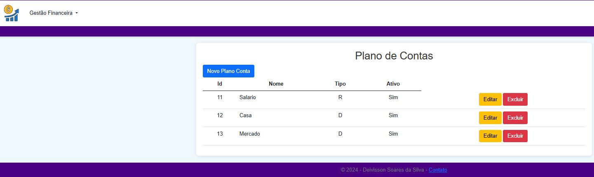
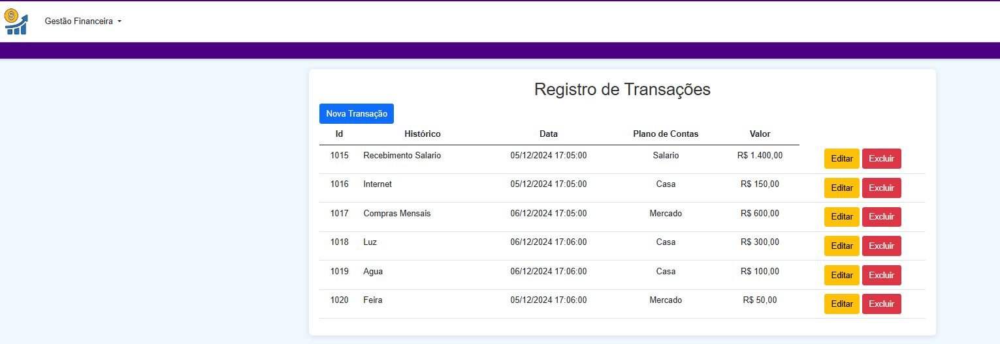
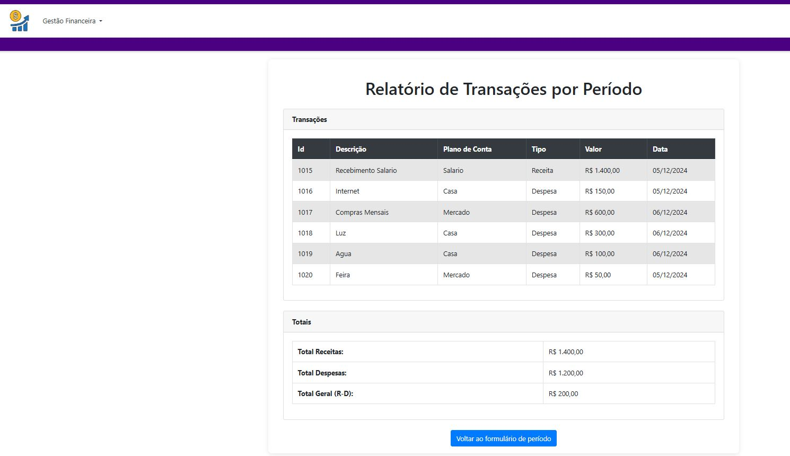
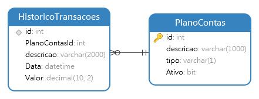

# myfinance-web-dotnet
- [myfinance-web-dotnet](#myfinance-web-dotnet)
	- [Sobre](#sobre)
  	- [Plano de Contas](#plano-de-contas)
  	- [Registro de Transações](#Registro-de-Transações)
  	- [Relatório de Transações por Período](#Relatório-de-Transações-por-Período)
  	- [Despesas x Receitas](#Despesas-x-Receitas)
	- [Diagrama do banco de dados](#diagrama-do-banco-de-dados)
	- [Como conectar ao banco de dados](#como-conectar-ao-banco-de-dados)
  	- [Benefícios da Clean Architecture](#benefícios-da-clean-architecture)

## Sobre

MyFinance é um projeto desenvolvido como parte do curso de Pós-Graduação em Engenharia de Software da PUC-MG.
Este sistema foi projetado para gerenciar finanças pessoais, utilizando a stack .NET e o banco de dados SQL Server.

O projeto segue os princípios da Clean Architecture, garantindo um código modular, testável e de fácil manutenção.
A separação de responsabilidades está estruturada em:

Camada de Aplicação: Regras de negócio específicas do caso de uso.
Camada de Domínio: Regras de negócio genéricas e entidades.
Camada de Infraestrutura: Acesso a dados e integração com serviços externos.
Camada de Interface: Apresentação utilizando MVC.

## Plano de Contas

## Registro de Transações

## Relatório de Transações por Período

## Despesas x Receitas

## Diagrama do Banco de Dados

## Como conectar ao banco de dados

Para configurar a aplicação em ambiente local, siga os passos abaixo:

Criar o banco de dados no SQL Server utilizando o script fornecido na pasta ScriptBd.
Faça atualização dos packages do projeto.
Alterar a string de conexão no arquivo appsettings.json, localizado no diretório myfinance-web-dotnet/.
Atualize os valores de Server (endereço do servidor de banco de dados) e Database (nome do banco de dados).
Exemplo de ConnectionString:

"ConnectionStrings": {
    "DefaultConnection": "Server=SEU_SERVIDOR;Database=SEU_BANCO_DE_DADOS;User Id=SEU_USUARIO;Password=SUA_SENHA;"
}

## Benefícios da Clean Architecture
O uso da Clean Architecture no projeto permite:

Maior clareza no código, com cada camada tendo responsabilidades bem definidas.
Facilidade para manutenção e inclusão de novas funcionalidades.
Redução do acoplamento, promovendo um sistema mais robusto e escalável.
